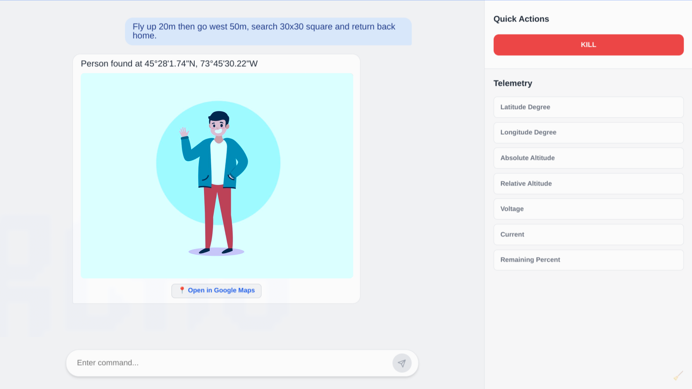

# GroundBase

A simple Electron-based UI implementation for communicating with [Finch](https://github.com/arkadii888/Finch) via TCP.



## How does it work?

System commands are sent using the ```#command``` format. For example:

- ```#kill``` — to completely shut down the drone.

- ```#telemetry``` — to retrieve real-time telemetry data.

Any other text entered into the input field will be treated as a prompt.

## Getting Started

```js
npm install
npm run dev
```
